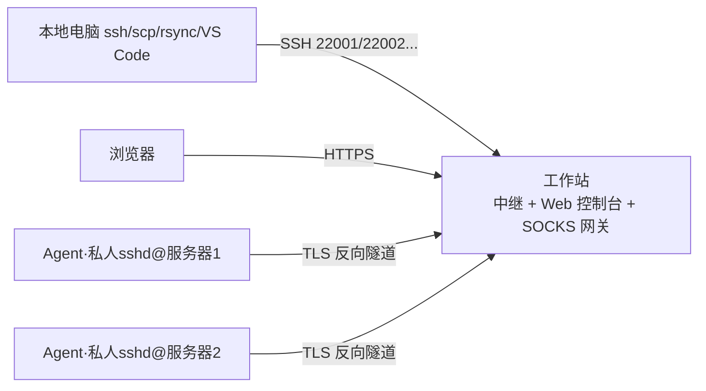
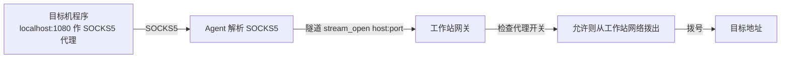

# 自用 SSH 管理平台 - 技术计划

## 1. 目标与约束

**目标**：让本地电脑可以用标准 SSH 工具（ssh / scp / rsync / VS Code Remote / git / sshfs）直接连上
各目标服务器，目标服务器仅能通过堡垒机访问，且不允许用自有用户名直接 SSH 登录。

**方案核心**：在每台目标机上以"自己的用户"运行一个 Agent（内置 SSH 服务器），Agent 反向连到
一台独立的工作站；工作站开固定端口做纯 TCP 透传。SSH 握手由目标机上的 Agent 完成，
因此不依赖 sshd 配置、不需要 su、不需要 root。

**约束**：
- 目标机只有堡垒机一个入口，sshd 禁止自有用户名直接登录
- 目标机有 systemd（保活用 systemd user 服务）
- 工作站是独立机器，不需要经堡垒机即可访问，目标机能连到它
- 自用，单用户，规模小（几台到十几台服务器）

**明确不做（v1）**：`-L`、`-R`、本地 `-D`。协议预留扩展点，后续可加。

## 2. 架构



三个组件：

### Agent（Go 单文件，每台目标机一个，systemd user 保活）
- 内置 SSH 服务器：
  - 公钥认证，读取目标机上自有用户的 `~/.ssh/authorized_keys`（现有的密钥直接生效）
  - PTY shell、exec、SFTP（scp/rsync/VS Code 依赖）
  - 主机密钥持久化在 `~/.ops/agent/`，保证本地 `known_hosts` 稳定
- 反向隧道客户端：TLS + 每机 token 连工作站，心跳 + 断线自动重连
- 本机 SOCKS5 代理监听（默认 127.0.0.1:1080），供目标机程序借用工作站网络
- 配置文件：`~/.ops/agent/config.json`

### 工作站（Go 单文件 + Web 页面，systemd 服务）
- 接受各 Agent 的反向连接，每台服务器分配固定中继端口（22001 起，纯字节透传）
- 内置 SOCKS 网关：接收 Agent 隧道里发来的 CONNECT 请求，从工作站网络拨出；
  受 Web 上每台服务器的"代理开关"控制（默认关），记录代理访问日志
- SQLite 数据库：服务器清单、状态、审计日志
- Web 控制台：
  - 服务器增删、在线/离线状态、Agent 版本、最后心跳、中继端口
  - 每台服务器：停用/启用（立即断隧道并拒绝重连）、手动重连
  - Web 终端（xterm.js，走同一隧道）
  - 日志查询（事件、终端会话、命令、代理使用）
  - 为每台服务器生成安装命令

### 本地电脑
- 只改 `~/.ssh/config`，固定端口，无需安装新软件

## 3. 隧道协议

Agent 与工作站之间：一条 TLS TCP 长连接，长度前缀帧多路复用。

帧格式：`[4字节总长][1字节类型][4字节流ID][负载]`

帧类型：
| 类型 | 说明 |
|---|---|
| register | Agent 注册：server_id、token、版本、主机名 |
| control | 控制消息（JSON）：配置下发（如代理开关变化）、重连指令 |
| stream_open | 打开一条数据流（SSH 透传 / SOCKS CONNECT 请求） |
| stream_data | 流数据 |
| stream_close | 关闭流 |
| heartbeat / ack | 心跳与确认 |

多路复用规则：每条数据流一个流 ID；SSH 中继连接和 SOCKS 连接互不干扰，
支持一台服务器同时多个 SSH 会话。

## 4. 反向 SOCKS（-D 需求）数据流



- Agent 本地只做 SOCKS5 解析；拨号完全在工作站完成
- 开关默认关；关闭时工作站直接拒绝该服务器的 CONNECT
- 代理目标（host:port）写入审计日志

## 5. 目录结构

```
.
├── cmd/
│   ├── agent/          # 目标机端二进制入口
│   └── relay/          # 工作站端二进制入口（中继 + Web）
├── internal/
│   ├── tunnel/         # 帧协议、多路复用、TLS/CA（两侧共用）
│   ├── agent/          # SSH 服务器、SOCKS 监听、隧道客户端、配置
│   ├── relay/          # 隧道服务端、端口透传、SOCKS 网关、DB、API、Web
│   └── bootstrap/      # 安装脚本模板
├── web/                # 前端静态文件（嵌入二进制）
├── scripts/            # 引导安装脚本模板
├── docs/               # 部署文档
├── Makefile
├── go.mod
└── PLAN.md
```

## 6. 数据库（SQLite）

`servers`：id、name（唯一）、token_hash、relay_port、proxy_enabled、
admin_enabled（停用/启用）、agent_version、hostname、last_seen、created_at

`audit_log`：id、ts、server_id、kind（event/command/terminal/proxy/auth）、detail

token 只存哈希；完整 token 仅在生成的安装命令中出现一次。

## 7. Web API（v1）

- `POST /api/login`：登录（单 token）
- `GET /api/servers`、`POST /api/servers`、`DELETE /api/servers/{id}`
- `PUT /api/servers/{id}`：停用/启用、代理开关
- `POST /api/servers/{id}/reconnect`：手动重连
- `GET /api/servers/{id}/install`：生成安装命令
- `GET /api/servers/{id}/logs`
- `WS /api/servers/{id}/terminal`：Web 终端（工作站用专用平台密钥走同一隧道连接 Agent）

## 8. 安全设计

- 工作站首次启动生成自签 CA；Agent 配置里固定 CA 指纹，双向校验
- 每台 Agent 独立随机 token（256-bit），DB 只存哈希，可吊销
- SSH 中继端口绑工作站对外网卡，防火墙仅放行自有 IP；SSH 公钥认证兜底
- Web 控制台登录 token；建议后续用 nginx + HTTPS 反代
- 代理开关默认关、按需开，代理目标全部记日志
- 全程不出现任何服务器密码；`su` 只在首次安装时手工做一次

## 9. 里程碑

### M1 隧道骨架
帧协议 + 多路复用 + TLS/CA + 注册/心跳。验收：本机跑 relay 和 agent，
通过中继端口可透传任意 TCP 字节（echo 测试）。

### M2 Agent SSH 服务器
authorized_keys 认证、PTY shell、exec、SFTP。验收：本地 `ssh -p 22001`、
`scp`、`rsync` 全通。

### M3 Web 控制台基础
SQLite、服务器增删、状态展示、日志、停用/启用、手动重连。

### M4 Web 终端
xterm.js ↔ WebSocket ↔ 隧道 ↔ Agent。

### M5 反向 SOCKS
Agent 本地 SOCKS5 监听、工作站网关、Web 开关、代理日志。
验收：目标机上 `curl --socks5-hostname 127.0.0.1:1080` 走工作站网络出口。

### M6 引导安装与部署
Web 生成安装脚本、systemd user 保活（linger 优先、cron @reboot 兜底）、
工作站 systemd 服务、防火墙说明、端到端冒烟测试、README/DEPLOY 文档。

## 10. 技术栈

- Go 1.22+，两个单文件二进制，交叉编译 linux/amd64、linux/arm64
- gliderlabs/ssh（SSH 服务器）、pkg/sftp（SFTP）
- modernc.org/sqlite（纯 Go，无 CGO）
- WebSocket（nhooyr.io/websocket 或 gorilla）
- xterm.js（前端终端）

## 11. 风险与限制

- VS Code Remote 需要目标机有 curl/wget、tar（通常自带）
- Agent 主机密钥变更会使本地 known_hosts 报警（设计上不自动变更）
- Agent 离线时 Web 终端/命令不可用，状态页显示最后心跳时间
- 工作站是单点；自用规模下可接受，后续可加主备

## 12. 实现状态（2026-07-31）

- M1 隧道骨架：✅ 帧协议、多路复用、TLS/CA、注册/心跳、端口透传（并发 3 路 echo 测试通过）
- M2 Agent SSH 服务器：✅ shell/exec/PTY/SFTP，ssh/scp/sftp/rsync、5 路并发通过
- M3 Web 控制台基础：✅ 增删/状态/日志/停用启用/手动重连/安装命令（含 token 轮换）
- M4 Web 终端：✅ xterm.js + WebSocket，走同一隧道（端到端验证通过）
- M5 反向 SOCKS：✅ Agent 本机 SOCKS5 + 工作站网关 + Web 开关 + 审计（开/关验证通过）
- M6 引导与部署：✅ `agent install`（systemd user 保活 + nohup/cron 回退）、
  `/download/agent|ca|webkey`、README 与部署文档
- Agent 在线升级：✅ Web 按钮触发，SSH 执行升级脚本（SHA256 校验 + 自动重启），
  0.1.0 → 0.2.0 端到端验证通过
- 多人使用（路线 A：单 Agent + sudo）：✅ 用户体系（登录/管理员/成员）、
  用户密钥集中管理并下发、服务器默认用户（sudo 切换）、按人审计、
  列出目标机用户 API；端到端验证通过（含 sudo 拒绝/成功两种路径）
- 待办（v2）：`-L` 转发、`-R`/本地 `-D`、Web 控制台 HTTPS 一键化、
  每用户×服务器级默认用户覆盖、审批流
