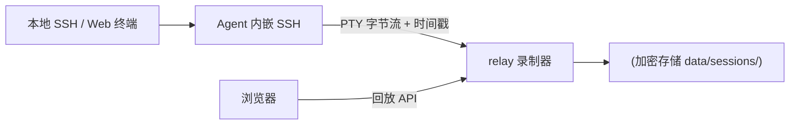

# Causeway v2 计划（草案）

> 状态：讨论中，未立项。对应 PLAN.md 的"待办（v2）"清单。

## 1. 背景与目标

v1（v0.3.0）已经打通核心链路：Agent 内嵌 SSH 服务器 + 反向 TLS 隧道、
工作站端口透传、Web 控制台、Web 终端、反向 SOCKS（-D）、多人使用（用户/
密钥/默认用户/sudo 切换）、Agent 在线升级、审计日志（元数据级）。

v2 要解决四个方向的问题：

1. **合规审计闭环**：v1 只记录"谁、何时、连接了哪台服务器、会话起止"，
   没有会话内容。v2 补齐 PTY 会话录制与回放。
2. **端口转发缺口**：v1 只做了 -D（目标机借用工作站网络），
   按之前的约定，-L / -R 放到 v2。
3. **多人协作权限细化**：当前成员能看到全部服务器，默认用户是服务器级。
4. **运维易用与安全加固**：告警、批量操作、审计导出、原生 HTTPS、
   登录防护、备份等。

## 2. 优先级总览

| 优先级 | 内容 | 一句话说明 |
| --- | --- | --- |
| P0 | 会话录制与回放 | 补上合规审计缺口，回答"实际看到了什么" |
| P1 | -L / -R 端口转发 | 补全隧道能力（-D 已满足主要需求，不急） |
| P1 | 服务器分组/可见范围、用户级默认用户 | 多人协作权限细化 |
| P2 | 离线告警、批量操作、审计导出、Web 文件管理 | 运维易用 |
| P2 | 原生 HTTPS、登录防护、密钥轮换、备份 | 安全加固 |
| P3 | 终端多标签、移动端适配 | 体验打磨 |

## 3. P0 — 会话录制与回放

### 目标

把合规审计从"元数据级"提升到"内容级"：管理员能在 Web 上按时间轴回放
任意一次终端会话，看到用户实际执行了什么、输出了什么。

### 数据流

### 关键设计点（待定，立项前讨论）

- **录制粒度**：全部会话 vs 按服务器/用户开关；默认关，防止磁盘暴涨
- **记录内容**：PTY 输出流（用户看到的画面）+ 时间戳；可选记录输入流
  实现全保真回放；非 PTY（exec）会话记录输出与退出码
- **格式**：append-only 日志（原始字节 + 时间戳），回放按时间重放；
  可输出 asciinema 兼容格式便于导出
- **传输**：复用现有隧道 mux，新增录制流类型；agent 对 PTY 数据"双写"
  （一份给客户端、一份给录制流）
- **存储**：relay 按 `server/date/session-id` 分片；AES-GCM 加密
  （密钥保存在 data 目录，随 data 备份一起备份）；保留策略可配置
  （默认 30 天自动清理）
- **审计关联**：session-id 与现有审计记录（谁、哪台服务器、起止时间）关联
- **回放**：Web 用 xterm.js 按时间轴播放，支持暂停/拖动/倍速
- **权限**：默认仅管理员可回放；成员可选仅回放自己的会话

### 验收标准

- 打开/关闭录制后，新会话按配置录制
- Web 回放与原始会话画面一致（含窗口尺寸变化）
- 录制文件加密落盘，删除旧文件按保留策略执行
- 回放操作记入审计日志

### 里程碑

- **M7 会话录制与回放**（P0）

## 4. P1 — 端口转发补全（-L / -R）

### 背景

v1 按讨论只做了 -D（目标机借用工作站网络，Web 开关控制）。
之前约定 -L / -R 放 v2；当前"目标机访问本地端口"和"本地访问目标机内网
端口"的需求不迫切，故列 P1。

### 范围

- **-R**：目标机程序访问你本地/工作站的端口（反向端口转发）
- **-L**：本地直连目标机内网端口（本地端口转发）

### 设计要点

- 沿用现有隧道 mux 与控制消息，不引入新协议
- Web 开关 + 绑定地址/端口白名单 + 审计日志
- 会话级临时转发（随 SSH 会话生命周期）可后置

### 里程碑

- **M8 端口转发与权限细化**（P1）

## 5. P1 — 多人协作权限细化

- **服务器分组/可见范围**：成员只看到被授权的服务器
  （当前全员可见全部服务器）；管理员可给成员分配服务器
- **用户级默认用户覆盖**：现有"服务器级默认用户"基础上，
  允许成员设置自己的默认用户（会话时优先用个人设置）
- 审批流（v1 待办提过）：小团队先不做，保留讨论

## 6. P2 — 运维易用

- **离线告警**：agent 掉线超过阈值 → webhook/邮件通知
- **批量操作**：批量升级 agent、批量启停服务器
- **审计导出**：审计日志导出 CSV/JSON，按时间/服务器/用户过滤
- **Web 文件管理**：浏览器里上传/下载/浏览/重命名文件，
  复用现有 SFTP 通道

## 7. P2 — 安全加固

- **原生 HTTPS**：relay 直接提供 HTTPS（可选证书配置），
  不再依赖 nginx 反代
- **登录防护**：登录失败限速/锁定、可选 TOTP 两步验证（管理员）
- **密钥/证书轮换**：Web 操作轮换 agent token、主机密钥、CA/证书
- **备份**：data 目录一键备份下载（含 CA、DB、录制文件）

## 8. P3 — 体验

- Web 终端多标签、搜索增强、移动端适配

## 9. 明确不做（v2 不纳入）

- 多工作站高可用（单点在工作站，自用规模可接受，后续另行评估）
- 公共云托管 / SaaS 化
- Windows / macOS 目标机 Agent
- HTTP 代理协议（非 SOCKS）扩展

## 10. 里程碑规划

| 里程碑 | 内容 | 目标版本 |
| --- | --- | --- |
| M7 | 会话录制与回放（P0） | v0.4.0 |
| M8 | -L/-R + 服务器权限/用户级默认用户（P1） | v0.5.0 |
| M9 | 运维易用 + 安全加固（P2） | v0.6.0 |
| M10 | 体验打磨（P3） | v0.7.0 |

## 11. 待讨论问题

1. 会话录制默认开还是关（合规要求 vs 存储/隐私成本）
2. 录制内容对成员是否可见（管理员专属 vs 本人可看）
3. -R 的绑定地址限制策略（是否只允许回环/白名单）
4. TOTP 是否必须（小团队规模下的必要性）
5. 审计导出的格式与字段需求
6. 离线告警的通知渠道（webhook 兼容企业微信/Slack？）
